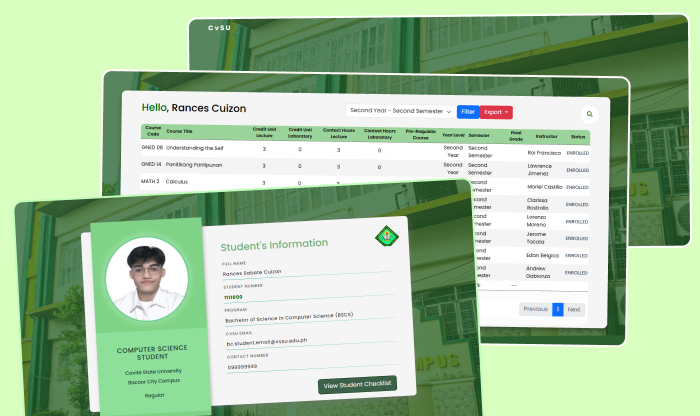

# Student Checklist

A web designed for academic record management, the Personal Academic Checklist allows students to view and track their academic progress with ease. Built with a focus on usability and efficiency, this application provides an organized view of personal information, courses, grades, instructors, and units, all stored securely in a MySQL database.

This project was developed as part of a midterm assignment for the Advanced Database Management System course.

## Features

- **Course Table**: Displays a list of information, with columns for course code, course name, lecture and laboratory units, year level, pre-requisite instructor, grade, and status.
- **Live Search Bar**: Allows users to search through all course data
- **Pagination**: Organizes large amounts of data into pages for easier navigation
- **Export to Sheets:**: Enables users to export their academic records to a spreadsheet (CSV format).

## Technologies I Used

**Front-end:** HTML, CSS, Bootstrap, JavaScript  

**Back-end:** PHP

**Database:** MySQL

## Screenshots

## License

This project is licensed under the [MIT](https://choosealicense.com/licenses/mit/) License - see the LICENSE file for details.
